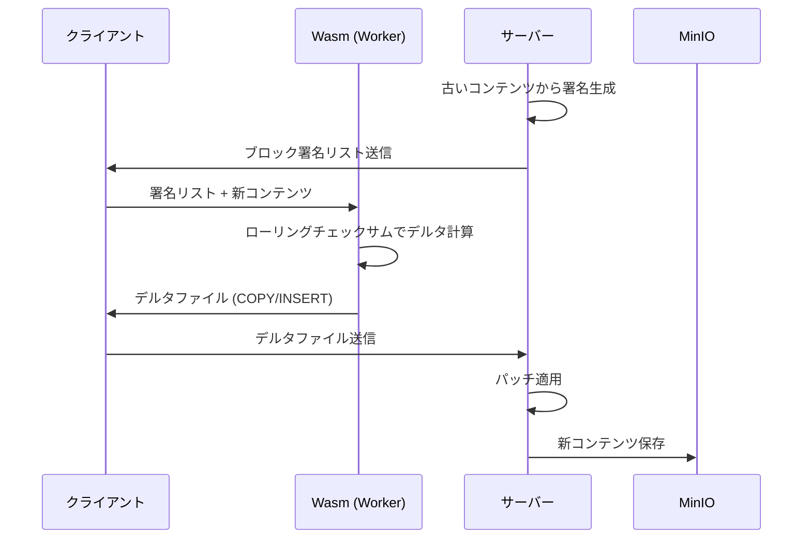

# Jade - 高速Markdownエディタ (プロトタイプ)

## 📄 概要

**Jade**は、大規模なノートデータセットに対して高い応答性と高速な計算パフォーマンスを実現するMarkdownエディタです。**差分同期プロトコル**と**WebAssembly (Wasm)** を活用し、データ転送量と計算時間を最小化します。

### 主な特徴

- 🚀 **高速計算**: Rust/Wasmによる計算処理のオフロード
- 🔄 **差分同期**: Rsyncライクなプロトコルによる効率的なデータ転送
- 🔗 **双方向リンク**: グラフベースのノート管理とビジュアライゼーション
- 🔍 **全文検索**: Elasticsearchによる高速検索
- ⚡ **非同期処理**: Web Workerによるメインスレッドのブロック回避

---

## 🏗️ アーキテクチャ

### システム構成

| コンポーネント | 技術スタック | 役割 |
|:---|:---|:---|
| **クライアント (UI)** | React / TypeScript / Vite | Wasmモジュールの呼び出し、UI描画、ユーザー操作の処理 |
| **バックエンド (API)** | Bun / Express / TypeScript | APIゲートウェイ、データI/Oロジック、クライアントとストレージの仲介 |
| **オブジェクトストレージ** | MinIO (S3互換) | ノートのMarkdownファイル実体（バイナリデータ）の保存 |
| **メタデータDB** | DynamoDB Local | ノードID、リンク関係、更新タイムスタンプなど高速アクセスが必要な属性情報 |
| **全文検索エンジン** | Elasticsearch | ノート内容の高度な全文検索インデックス |
| **計算エンジン** | Rust / WebAssembly | リンク解析、グラフレイアウト、差分署名/デルタ計算の実行 |

---

## ⚡ 高速化プロトコル仕様

### 1. 双方向リンク・グラフ計算

| 項目 | 仕様 |
|:---|:---|
| **処理内容** | リンク解析（`[[リンク]]`抽出）、グラフレイアウト計算（力指向アルゴリズム） |
| **Rust関数** | `generate_signatures` (前段の準備)、`compute_delta` (差分計算) |
| **実行戦略** | **Web Worker**内で非同期実行し、メインスレッドのブロックを回避 |
| **グラフ描画** | **インクリメンタル計算**を採用し、中間座標データ（`NodePosition`）を段階的に返すことで、計算中もノードが動く**動的な更新**を実現 |

### 2. 差分同期プロトコル (Rsyncライク)

ネットワーク転送量を最小化するための核となるプロトコルです。

| ステップ | 実行主体 | 実行内容 | Wasm関数 |
|:---|:---|:---|:---|
| **1. 署名生成** | バックエンド（サーバー） | 古いノートコンテンツをブロックに分割し、**弱いチェックサム**と**強いハッシュ**からなる**ブロック署名リスト**を生成 | `generate_signatures` |
| **2. デルタ計算** | クライアント (Wasm) | 署名リストと最新コンテンツを比較し、**ローリングチェックサム**を用いて一致ブロックを高速探索 | `compute_delta` |
| **3. デルタファイル** | クライアント → サーバー | **`COPY`**（既存ブロック）と**`INSERT`**（新しいデータ）命令で構成される**デルタファイル**を生成・送信 | N/A (JSが送信) |
| **4. パッチ適用** | バックエンド（サーバー） | デルタファイルと古いコンテンツに基づき、新しいノートコンテンツを再構築し、MinIOに保存 | N/A |

#### 差分同期のフロー



---

## 🛠️ 技術的決定事項

### データ転送
- Wasmとのデータのやり取りは、オーバーヘッドを減らすため**JSON文字列のシリアライズ/デシリアライズ**を基本とする

### 同期戦略
- 同期はファイル全体ではなく**差分（デルタ）ベース**とし、常に高速なデータ適用を目指す

### Wasm連携
- **`wasm-pack`**と**`wasm-bindgen`**を使用し、RustコードをTypeScript/Reactから容易に利用できる形式にコンパイル

### Elasticsearch統合
- **Bun環境での互換性**のため、公式クライアントの代わりに**HTTPベースの簡易クライアント**を実装
- `fetch` APIを使用してElasticsearch REST APIに直接通信

### DynamoDB Local
- 開発環境では**インメモリモード**で動作し、ファイルシステムの権限問題を回避
- データは揮発性だが、開発時の再現性を優先

### 将来の検討
- **Zig言語**を、Markdownの**高速字句解析/構文解析**など、特に低レベルなコア処理のさらなる最適化のために導入する可能性を保持

---

## 🐳 ローカル開発環境

すべてのサービスは**Docker Compose**を用いて、本番環境をシミュレートする形で一括構築・管理されます。

### 必要な環境
- **Docker** (必須)
- **Docker Compose** (必須)
- Bun (ローカル開発時)
- Rust / wasm-pack (Wasm開発用)

### Docker構成
- **minio**: S3互換オブジェクトストレージ
- **dynamodb**: DynamoDB Local（インメモリモード）
- **elasticsearch**: 全文検索エンジン
- **api**: バックエンドAPIサーバー（Bun + Express）
- **client**: フロントエンド開発サーバー（Vite）

### セットアップ

**推奨: Docker Composeを使用した一括起動**

```bash
# リポジトリのクローン
git clone https://github.com/u1e2k/markdown-editor.git
cd markdown-editor

# すべてのサービスを一括起動
docker compose up -d

# ログ確認
docker compose logs -f
```

**手動セットアップ（開発用）**

```bash
# Wasmモジュールのビルド
cd wasm
wasm-pack build --target web
cd ..

# サーバーのセットアップ
cd server
bun install
bun run dev &
cd ..

# クライアントの起動
cd client
bun install
bun run dev
```

詳細なセットアップ手順は [SETUP.md](./SETUP.md) を参照してください。

### サービスエンドポイント

| サービス | エンドポイント |
|:---|:---|
| クライアント | http://localhost:3000 |
| API | http://localhost:8080 |
| MinIO Console | http://localhost:9001 |
| DynamoDB Local | http://localhost:8000 |
| Elasticsearch | http://localhost:9200 |

---

## 📊 パフォーマンス目標

| 指標 | 目標値 |
|:---|:---|
| 初期読み込み時間 | < 1秒 (10,000ノート) |
| グラフレイアウト計算 | < 2秒 (1,000ノード) |
| 差分同期速度 | > 90% 削減 (vs 全体転送) |
| 全文検索応答 | < 100ms |

---

## 🔧 開発ロードマップ

- [ ] Phase 1: 基本的なMarkdownエディタUI
- [ ] Phase 2: Rust/Wasmモジュールの統合
- [ ] Phase 3: 差分同期プロトコルの実装
- [ ] Phase 4: グラフビジュアライゼーション
- [ ] Phase 5: 全文検索機能
- [ ] Phase 6: パフォーマンス最適化とベンチマーク

---

## 📝 ライセンス

MIT

---

## 🤝 コントリビューション

プルリクエストを歓迎します。大きな変更の場合は、まずissueを開いて変更内容を議論してください。